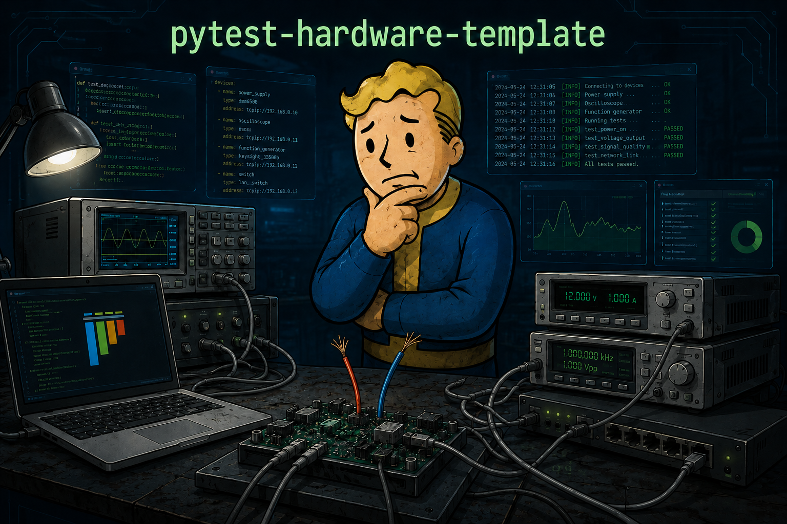

<p align="center">
  
</p>

[](https://www.python.org/downloads/)
[](https://pytest.org/)
[](LICENSE)

# pytest-hardware-template

A reusable template for automated testing of network, laboratory, embedded, and
other physical equipment. It provides a small, typed framework around pytest, declarative YAML
inventory, dependency-injected devices, and transport abstractions. It deliberately contains no
vendor-specific protocol logic or real credentials.

```text
pytest --stand
       ↓
inventory/stands.yaml + inventory/devices.yaml
       ↓
StandConfig → StandFactory → TestStand
                              ↓
                         Device API
                              ↓
                    Transport abstraction
                              ↓
                     physical equipment
```

The project keeps three kinds of configuration separate:

- **settings** — global runtime defaults, credentials, and secrets loaded from the environment;
- **inventory** — physical devices, connection topology, and logical test stands;
- **configs** — data for individual test scenarios.

## Using this template

Create a repository from this template, then adapt the skeleton to the concrete project.
At minimum, replace:

- `pytest-hardware-template` with the repository and distribution name;
- `hardware_test` with the desired Python package name;
- the example `Dut`, `Analyzer`, and `Generator` APIs;
- the documentation-only addresses and devices in `inventory/devices.yaml`;
- this README description.

Do not commit `.env`, passwords, real organization addresses, or other secrets. Inventory refers
to named credentials; secret values belong in environment variables or a local `.env` based on
`.env.example`.

## Setup

Python 3.14 and [uv](https://docs.astral.sh/uv/) are required.

```bash
uv sync
uv run pre-commit install
```

By default, SSH uses strict known-host verification. Add real equipment keys to the user's known
hosts file rather than disabling verification.

## Running tests

Run framework tests:

```bash
pytest tests/unit tests/integration

# or, with uv
uv run pytest tests/unit tests/integration
```

Framework tests never need a physical stand.

Hardware tests use a logical stand key from `inventory/stands.yaml`. Its `device_files` list
references one or more physical equipment inventories, such as `inventory/devices.yaml`:

```yaml
version: 1
device_files:
  - devices/duts.yaml
  - devices/analyzers.yaml
  - devices/generators.yaml
```

Paths are resolved relative to `stands.yaml`. Device IDs must be unique across all listed files;
duplicate IDs fail inventory loading instead of silently overriding an earlier definition.

```bash
uv run pytest tests/hardware --stand stand-01
uv run pytest tests/hardware --inventory inventory/stands.yaml --stand stand-02
```

Collecting a test marked `hardware` without `--stand` fails with
`Hardware tests require --stand`. Hardware tests access roles such as `stand.dut`; they do not
depend on physical IDs or execute SSH commands directly.

## Architecture

`Inventory` models combine the stand and device YAML sources and validate all physical-device
references. `StandFactory` resolves physical devices, asks `TransportFactory` for connections,
asks `DeviceFactory` for typed device APIs, and returns a `TestStand` keyed by logical roles. The
stand only owns already-constructed device objects. It does not read files, environment variables,
or create transports.

Use conventional roles through `stand.dut`, `stand.analyzer`, and `stand.generator`, or access any
logical role with a runtime type check:

```python
primary = stand.device("analyzer_primary", Analyzer)
secondary = stand.device("analyzer_secondary", Analyzer)
```

`Transport` defines the basic connection contract. `SynchronizedTransport` wraps every concrete
transport created by the factory and provides serialized operations and explicit exclusive access
through `LockableTransport`. Concrete implementations keep Paramiko, pyserial, and other client
libraries outside device APIs. See the [transport architecture](docs/transports.md) for the
contracts, lifecycle, command flow, locking guarantees, and extension rules. Example device
methods raise `NotImplementedError` until a project supplies its own protocol.

### Linux serial console transports

`PicocomOverSshTransport` reaches a board's Linux serial console through `picocom` on a remote SSH
stand. It detects whether console login is required, manages the shell prompt, executes commands,
and returns their output and exit status. See the
[picocom-over-SSH guide](docs/picocom-over-ssh.md) for configuration and operational details.

`PySerialTransport` supports a locally attached serial console, while
`PySerialOverSshTransport` uses the standalone serial agent on a remote stand. See the
[pyserial transport guide](docs/pyserial-transports.md) for configuration and deployment.

### Class-based hardware tests

Use `BaseTest` for command logging and result validation in class-based hardware tests. Log
numbered scenario steps in the test itself, and keep setup and cleanup in `yield` fixtures. See the
[basic stand test example](docs/hardware-base-test.md) and the
[multi-device stand example](docs/multi-device-stands.md).

When one test group needs shared fixtures or helpers, add a local `base.py` under that group's
directory. Its class inherits from the shared `tests.hardware.base.BaseTest` and may expose
class-scoped fixtures as class methods. Test modules import the specialized class under the common
local name `BaseTest`:

```python
import pytest

from tests.hardware.recovery.base import RecoveryBaseTest as BaseTest


@pytest.mark.hardware
class TestServiceRecovery(BaseTest):
    ...
```

## Pytest markers

Available pytest markers are:

- `unit`
- `integration`
- `hardware`
- `smoke`
- `slow`
- `destructive`
- `stop_on_fail`

Marker spelling is checked with `--strict-markers`.

### Stop on fail

Use `stop_on_fail` when a failure makes the rest of the test session unsafe or meaningless. If
any setup, call, or teardown phase of a marked test fails, pytest finishes that phase and stops
the entire session, like `-x`. For a parameterized test, subsequent parameter cases and all later
tests are therefore not run:

```python
@pytest.mark.stop_on_fail
@pytest.mark.parametrize("mode", ["standby", "active", "fault"])
def test_mode_transition(mode: str) -> None:
    ...
```

### Timeout

Every test has a default timeout of 120 seconds. Override it only when a test is expected to take
longer:

```python
import pytest


@pytest.mark.timeout(600)
def test_firmware_update() -> None:
    ...
```

The timeout applies to unit, integration, and hardware tests. `pytest-timeout` selects the timeout
method supported by the current platform so ordinary runs retain the safest available behavior.

## Numbered test steps

Use `func_step_logger` to log significant actions with numbering that restarts for every test:

```python
from hardware_test.logging import StepLogger


def test_measurement(func_step_logger: StepLogger) -> None:
    func_step_logger.log("Configure analyzer")
    func_step_logger.log("Start measurement")
```

The corresponding log entries are:

```text
15:19:28.583 | INFO  | test_measurement                 | Step 1: Configure analyzer
15:19:28.584 | INFO  | test_measurement                 | Step 2: Start measurement
```

Use `cls_step_logger` only when numbering must continue between methods of one test class. Step
messages supplement assertions; they do not replace them. Never include passwords or other
secrets in log messages.

## YAML-parameterized scenarios

`yaml-test-params` generates pytest cases from YAML files in `configs/`. Its pytest plugin loads
automatically.

Define Pydantic models for a scenario and create a reusable source:

```python
from yaml_test_params.pytest import YamlConfigSource, yaml_parametrize

PARAMETERIZED_EXAMPLE_CONFIGS = YamlConfigSource(
    path="configs/common/parameterized-example.yaml",
    model=ParameterizedExampleConfigCollection,
)


@yaml_parametrize(PARAMETERIZED_EXAMPLE_CONFIGS, "parameterized-example")
def test_parameters(
    test_name: str,
    input_value: str,
    expected_value: str,
    repeat_count: int,
) -> None: ...
```

Scenario parameters belong in `configs/`; physical topology remains in `inventory/`, and secrets
remain in runtime `settings`.

See the [yaml-test-params documentation](https://github.com/fomenko-ai/yaml-test-params) for the
available models and parametrization options.

## Developer commands

Run the complete non-hardware quality gate before handing off changes:

```bash
./scripts/ci.sh
```

The script synchronizes dependencies from `uv.lock`, runs all pre-commit hooks, Ruff, ShellCheck,
ty, and unit and integration tests, then verifies that hooks leave no unstaged changes. It never
runs physical hardware tests and is intentionally independent of any CI provider. During
development, run the narrowest relevant test first, for example:

```bash
uv run pytest tests/unit/logging/test_step_logger.py -vv
```

Every pytest session writes human-readable and machine-readable results into one run directory:

```text
artifacts/
├── latest.log
└── <YYYY-MM-DD_HH-MM-SS_microseconds>/
    ├── pytest.log
    └── reports/
        └── junit.xml
```

`pytest.log` contains Python log messages, including numbered steps, while `junit.xml` contains
test outcomes and durations for CI systems. Both files are created automatically; no pytest CLI
options are required. `artifacts/latest.log` is a hard link to the log of the most recently started
pytest session, so new messages are available through both paths without duplicating file data.
During parallel runs, it points to the session started last; every run still retains its own
`pytest.log`. Generated artifacts are ignored by Git.

Noisy third-party loggers can be muted for every pytest run with `muted_loggers` in
`[tool.pytest.ini_options]`. Paramiko is muted by default. Add a logger for one run with a
repeatable command-line option:

```bash
uv run pytest --mute-logger urllib3 --mute-logger another_library
```

Command-line logger names supplement the configured list.

Clear all generated test artifacts with:

```bash
./scripts/clean-artifacts.sh
```

## AI agent skills

The repository includes focused skills under `skills/` for AI coding agents:

- `add-inventory-device` registers physical equipment in inventory;
- `add-test-stand` maps equipment to logical stand roles;
- `add-project-test` creates tests in the appropriate test layer;
- `hardware-base-test` creates or updates shared command helpers and class-based hardware tests;
- `adapt-template-change` analyzes and adapts selected changes from this template into a locally
  customized project;
- `adapt-internal-infrastructure` adapts Docker and CI configuration for private registries,
  proxies, corporate certificates, and other closed-network requirements.

To migrate a template feature or fix, invoke `adapt-template-change` and describe the desired
behavior. Optionally provide a commit, pull request, file link, patch, or local template checkout:

```text
Use $adapt-template-change to adapt the stop-on-fail marker from
https://github.com/fomenko-ai/pytest-hardware-template into this project.
Preserve our local pytest reporting behavior.
```

The skill inspects the source and target projects, proposes compatible implementation options, and
waits for approval before editing production files. If remote access is unavailable, provide a
path to a local clone of the template.

### Optional yaml-test-params skill

`yaml-test-params` includes the optional `add-yaml-parametrized-tests` skill for AI coding agents.
After installing the project dependencies, expose the bundled skill with:

```bash
uvx library-skills
```

See the [yaml-test-params documentation](https://github.com/fomenko-ai/yaml-test-params#ai-agent-skill)
for installation and usage details. The skill is optional and is not stored in this template.

## Docker

Build the test image from the locked project dependencies:

```bash
docker build -t pytest-hardware-template .
```

When building or running behind an organization VPN, HTTPS proxy, private registry, or corporate
CA, follow the [closed-network Docker guide](docs/closed-network.md). It explains host, build, and
runtime trust without committing organization-specific configuration or disabling verification.

The default container command runs unit and integration tests only:

```bash
docker run --rm pytest-hardware-template
```

Mount the artifacts directory when test logs and JUnit reports must remain on the host:

```bash
docker run --rm \
  --volume "$PWD/artifacts:/app/artifacts" \
  pytest-hardware-template
```

The image does not contain `.git`, `.env`, local virtual environments, caches, or generated
artifacts. Consequently, `./scripts/ci.sh` remains the complete quality gate for a working copy;
the container provides a reproducible test runtime rather than a Git-aware pre-commit environment.

Hardware tests from Docker must be started explicitly and require access to the stand network,
runtime credentials, and trusted SSH host keys. For example, on a Linux host:

```bash
docker run --rm \
  --env-file .env \
  --network host \
  --volume "$HOME/.ssh/known_hosts:/root/.ssh/known_hosts:ro" \
  --volume "$PWD/artifacts:/app/artifacts" \
  pytest-hardware-template \
  uv run pytest tests/hardware --stand stand-01
```

To run an already-built image on another host, transfer it through a container registry or with
`docker save` and `docker load`. Mount that host's inventory directory and select its `stands.yaml`
with `--inventory`; paths in `device_files` remain relative to the mounted `stands.yaml`:

```bash
docker run --rm \
  --env-file .env \
  --network host \
  --volume "$PWD/inventory:/runtime/inventory:ro" \
  --volume "$HOME/.ssh/known_hosts:/root/.ssh/known_hosts:ro" \
  --volume "$PWD/artifacts:/app/artifacts" \
  pytest-hardware-template \
  uv run pytest tests/hardware \
    --inventory /runtime/inventory/stands.yaml \
    --stand stand-01
```

See [Running a built image on another host](docs/docker-runtime.md) for image transfer, host
preparation, external inventory layout, hardware access, and troubleshooting.

Do not bake `.env`, credentials, or `known_hosts` into the image. Device mounts for USB, Serial,
VISA, and similar transports are platform- and project-specific and should be added only when
required.

## Continuous integration

The `ci/` directory contains inactive CI templates for GitHub Actions and GitLab CI.
Copy only the configuration required by the project:

```bash
# GitHub Actions
mkdir -p .github/workflows
cp ci/github-actions.yml .github/workflows/ci.yml

# GitLab CI
cp ci/gitlab-ci.yml .gitlab-ci.yml
```

Files under `ci/` are not discovered by either provider, so creating a repository from
the template does not enable CI or consume hosted-runner minutes automatically. Once activated,
both configurations execute `./scripts/ci.sh`, so local and hosted checks use the same locked
dependencies and non-hardware quality gate. Hardware tests are never started implicitly.

GitHub Actions uses a hosted `ubuntu-latest` runner, installs the pinned `uv` release with the
official `astral-sh/setup-uv` action, and then installs the latest Python 3.14 patch release. It
does not need a Docker image or a `.python-version` file because the runner and Python version are
declared directly in the workflow. After copying and pushing the workflow, it starts on every
push and pull request when GitHub Actions is enabled for the repository; no secrets are required.

GitLab CI uses the official pinned `uv` Docker image, which already contains Python 3.14. A runner
capable of pulling images from `ghcr.io` must be available to the project. Both providers cache
`uv` downloads using `uv.lock` as the cache dependency key.
