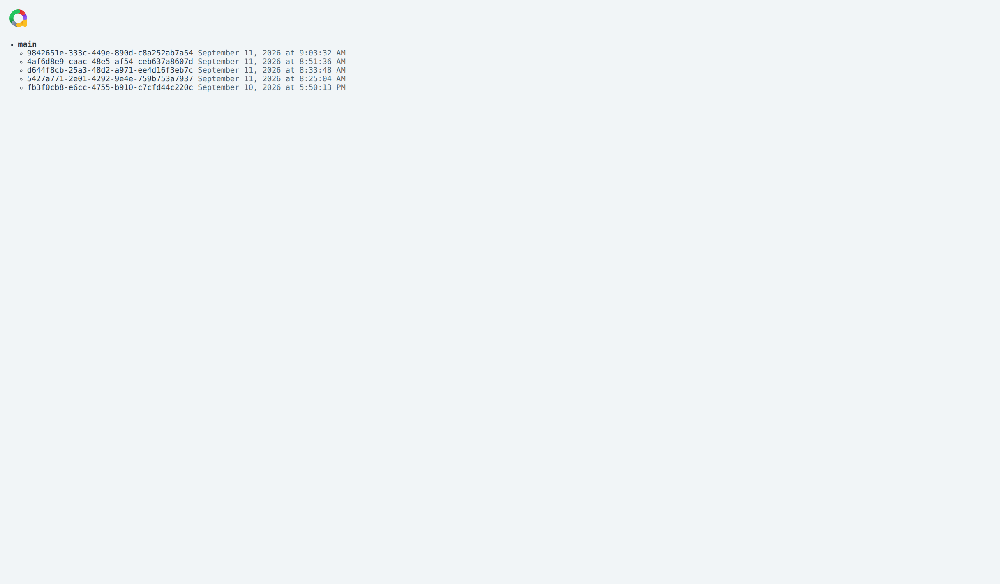
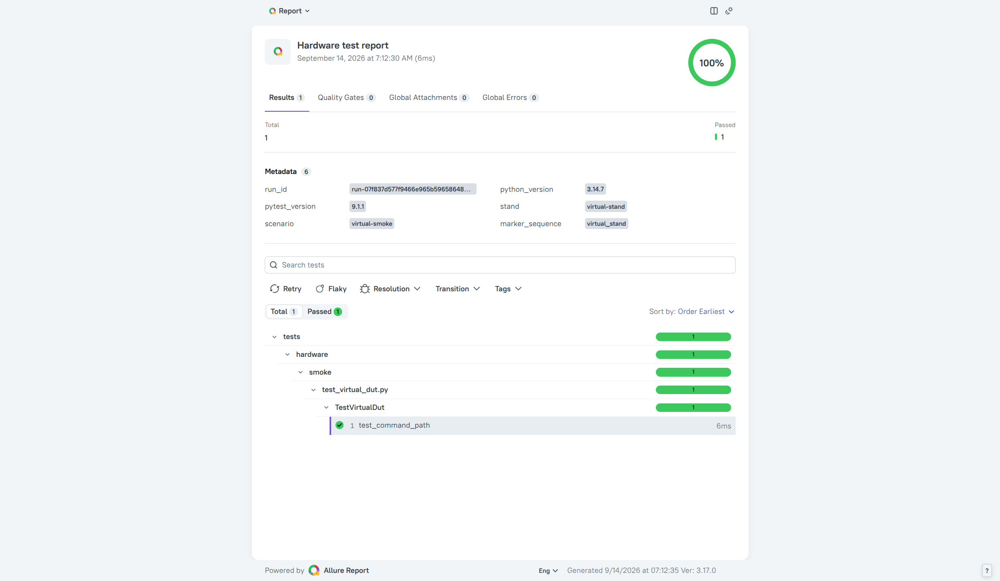

# Optional Allure 3 reporting

The ordinary test workflow always produces `pytest.log`, JUnit XML, and a self-contained HTML
report. Allure reporting is optional and has three separate parts:

- `allure-pytest` records raw test results;
- Allure 3 generates an HTML report from those results;
- Allure Report Storage publishes reports, retains history, and provides shareable URLs.

The template pins `allure-pytest` through the repository-local `allure` dependency group. It is
not part of the future `hardware_test` library's published dependencies. The deployment helper
pins Allure 3 to 3.17.0 and the official `allure/allure-report-storage` image to v1.0.1.

## Report flow

```text
pytest --allure
      │
      ▼
artifacts/<pytest-run-id>/allure-results/
      │  raw Allure JSON and attachments
      ▼
disposable Allure 3 publisher
      │  generates HTML and publishes with repo + branch metadata
      ▼
Allure Report Storage named volume
      ├── SQLite report metadata and history
      └── immutable published report files
              │
              ├──► direct report URL
              └──► /reports/tree?repo=<repository>
```

The Test Runner coordinates the same path after pytest finishes:

```text
Run tests ──► preserve pytest status and local artifacts
    │
    └──► publish allure-results ──► save report_url in current operation
                                      │
                                      ├──► Open Allure report
                                      └──► All Allure reports
```

Publication failure is reported separately and never changes the pytest exit code.

## Collect results locally

Install the optional adapter and run non-hardware tests:

```bash
uv sync --locked --group allure
uv run --group allure pytest tests/unit tests/integration --allure
```

The project option puts raw results into the same unique directory as the standard artifacts:

```text
artifacts/<pytest-run-id>/
├── pytest.log
├── allure-results/
└── reports/
    ├── junit.xml
    └── report.html
```

Without `--allure`, the adapter is not required and no Allure results are created. Passing
`--allure` without installing the group fails immediately with an installation hint. The standard
adapter option `--alluredir PATH` remains available when a caller deliberately needs a custom path;
use one mode or the other, not both. Both `--allure` and its configuration live in
`tests/conftest.py`, keeping the installed `hardware_test` pytest plugin independent of Allure.

At session start, the repository writes `environment.properties` into the selected results
directory. Allure 3 displays these values in **Metadata** at the top of the generated report:
`run_id`, `python_version`, `pytest_version`, and available `git_revision`, `stand`, `scenario`,
and `marker_sequence`. They match the run context in `pytest.log`, JUnit, and pytest-html.
The file is written before collection, so collection failures retain the context. It is
regenerated for the current run, including when using `--alluredir`. Rebuild the test image
to apply this change to container runs; previously published reports are not updated.

Hardware tests still require an explicitly prepared stand and `--stand`. Never run them merely to
validate reporting.

## Start and publish to Report Storage

From `helpers/allure/`, create an untracked configuration and replace both secret values with
independently generated, long random strings:

```bash
cd helpers/allure
cp .env.example .env
docker compose up --detach
curl --fail http://127.0.0.1:3000/api/ping
```

Mint the narrower report-access token used by publishers:

```bash
curl --silent --show-error --request POST http://127.0.0.1:3000/api/token \
  --header "Authorization: Bearer $ALLURE_STORAGE_BOOTSTRAP_TOKEN"
```

The returned `ars1...` value is not the bootstrap token. Export it as `ALLURE_ACCESS_TOKEN` for a
manual publisher invocation, or store it as `TEST_RUNNER_ALLURE_ACCESS_TOKEN` in the Test Runner's
untracked `.env`. The bootstrap token must never be given to a test container or publisher.

Build the pinned Allure 3 publisher image:

```bash
docker build --tag local/allure-publisher:3.17.0 .
```

After collecting results with the root project's `--allure` option, publish one run manually:

```bash
docker run --rm \
  --env ALLURE_ACCESS_TOKEN \
  --env GIT_CONFIG_COUNT=1 \
  --env GIT_CONFIG_KEY_0=safe.directory \
  --env GIT_CONFIG_VALUE_0=/workspace/pytest-hardware-template \
  --volume "$PWD/../..:/workspace/pytest-hardware-template:ro" \
  --volume "/absolute/path/to/run/allure-results:/results:ro" \
  --workdir /workspace/pytest-hardware-template \
  local/allure-publisher:3.17.0 \
  generate /results --config /opt/allure/allurerc.mjs
```

Allure 3 derives the repository from the checkout directory name and the branch from Git. Keep the
mount target's final component equal to the intended repository key; downstream projects replace
`pytest-hardware-template` in all three places above. The command prints the direct published
report URL. Browse the repository history at
`http://127.0.0.1:3000/reports/tree?repo=pytest-hardware-template`.

For a server deployment, bind Storage to loopback behind a TLS reverse proxy or to a protected
internal interface. The report-access token embeds the Storage URL, so mint it through the URL
that publishers can reach. Back up the named volume and define an operational retention policy;
Storage does not expire report history automatically.

## Publish from the Test Runner

Build the publisher image on the Docker host, then enable the optional integration in the Test
Runner's untracked `.env`:

```dotenv
TEST_RUNNER_ALLURE_ENABLED=true
TEST_RUNNER_ALLURE_PUBLISHER_IMAGE=local/allure-publisher:3.17.0
TEST_RUNNER_ALLURE_ACCESS_TOKEN=ars1.replace-with-report-access-token
TEST_RUNNER_ALLURE_PUBLIC_URL=http://192.0.2.10:3000
TEST_RUNNER_ALLURE_REPOSITORY=pytest-hardware-template
```

When enabled, Test Runner builds framework images with `INSTALL_ALLURE=true`, passes the configured
results directory through pytest's `--alluredir`, and publishes that directory with a disposable
publisher container. `TEST_RUNNER_ALLURE_RESULTS_PATH` defaults to `allure-results` relative to
the pytest session directory. Remote framework images supplied to the runner must already contain
the optional adapter.
The repository setting gives Storage a stable project key independent of the publisher container's
working-directory name. Browse the completed reports at
`http://<storage-host>:3000/reports/tree?repo=pytest-hardware-template`.
The public URL must be reachable by the user's browser. It enables the Test Runner's **All Allure
reports** link; the report-access token remains server-side.

The Storage tree groups completed reports by Git branch:



Selecting a report UUID opens the generated Allure 3 report:



Publication runs after both passing and failing tests. The operation keeps the original pytest
status and exit code. `report_status`, `report_url`, and `report_message` describe publication
separately, so an unavailable reporting service cannot turn passing tests into failed tests.

Tokens are injected into the publisher process environment and are never included in Docker
arguments, persisted operation state, UI configuration, or report messages. The browser receives
only `TEST_RUNNER_ALLURE_PUBLIC_URL` and the repository-tree link. Review test logs and attachments
for application secrets before publishing them.

Official references:

- [Allure pytest integration](https://allurereport.org/docs/pytest/)
- [Allure 3 report generation](https://allurereport.org/docs/v3/generate-report/)
- [Allure Report Storage](https://allurereport.org/docs/self-hosted-storage/)
- [Storage deployment with Docker](https://allurereport.org/docs/guides/self-hosted-storage-docker/)
