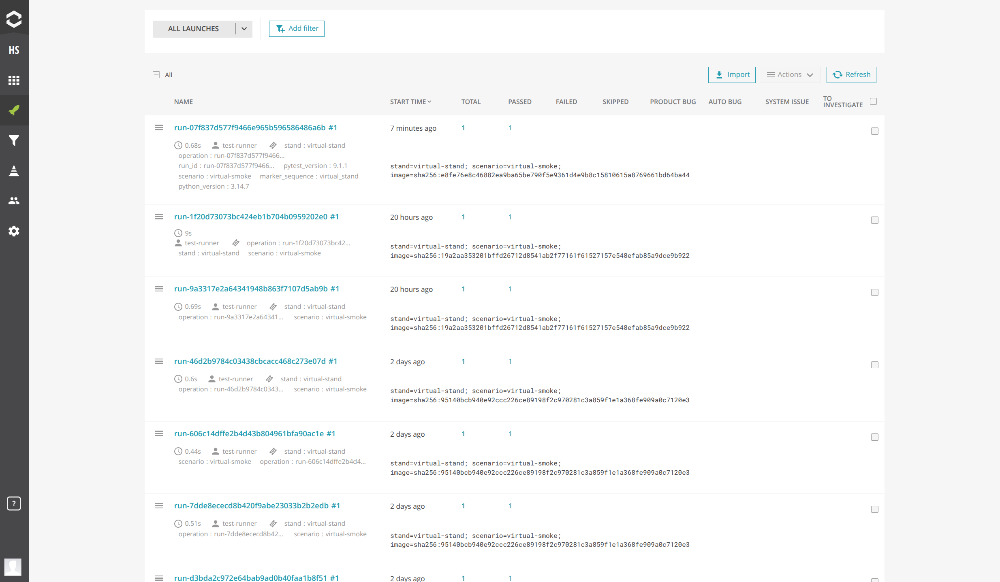
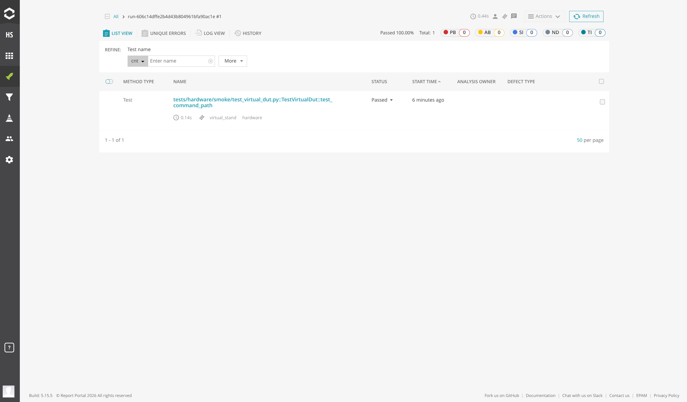
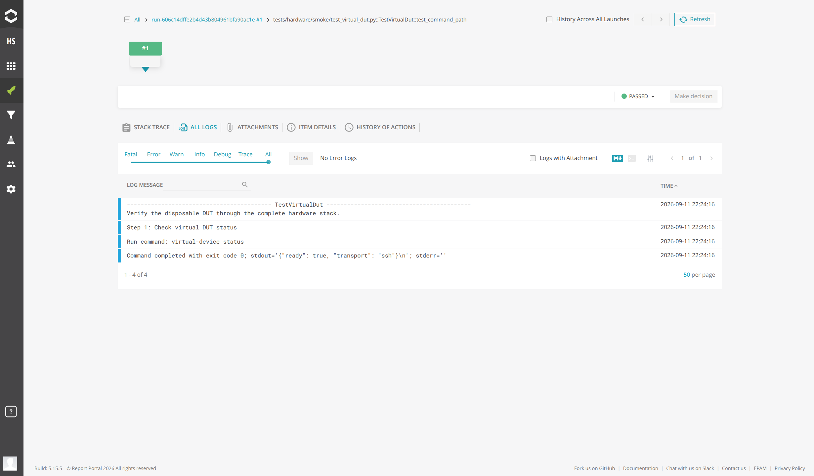
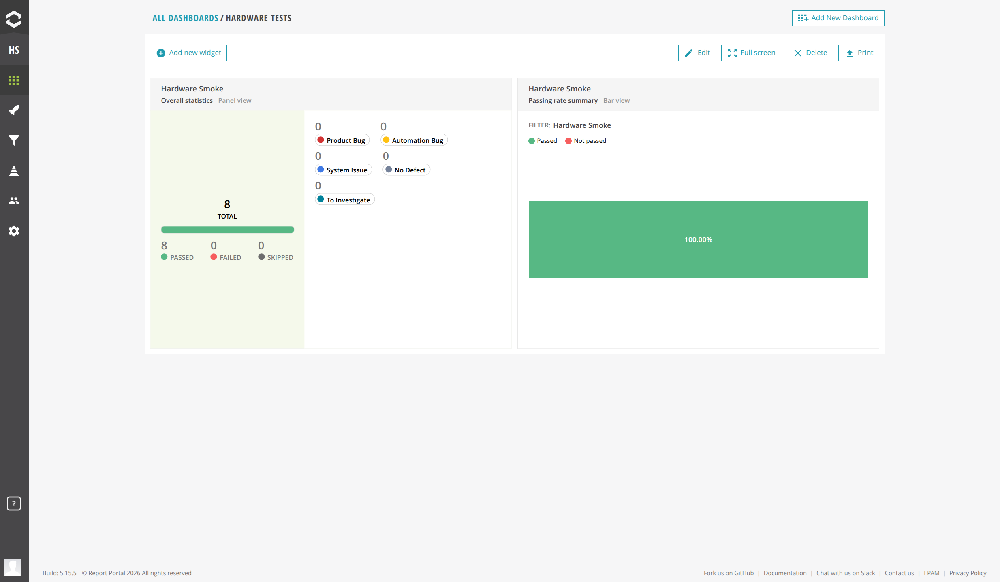

# Optional ReportPortal service

This independently deployed helper runs ReportPortal for the template and Test Runner.
`pytest-reportportal` sends test results and Python logs during a run. There is no post-run
HTML publisher and no conversion of Allure results. Both integrations can be enabled together.
ReportPortal is not a dependency of the published `hardware_test` package.

## Report flow

```text
pytest --reportportal
        │
        ▼
pytest-reportportal agent
        │  streams launch metadata, test statuses, logs, and attachments
        ▼
ReportPortal gateway and API
        │
        ├──► launch history and attributes
        ├──► test hierarchy, results, and duration
        ├──► logs and attachments
        └──► dashboards and analysis
                  │
                  ▼
          ReportPortal web UI
```

The Test Runner coordinates the launch while preserving its local process result and artifacts:

```text
Run tests ──► preserve pytest status, exit code, and local artifacts
    │
    ├──► pytest-reportportal streams results during execution
    │
    └──► look up completed launch ──► save reportportal_status and reportportal_url
                                             │
                                             ├──► Open ReportPortal launch
                                             └──► All ReportPortal launches
```

ReportPortal transmission or lookup failures are recorded separately and never change the pytest
exit code.

## UI preview

The launch list shows previous runs with test totals, results, and stand and scenario attributes.
Open it through **All ReportPortal launches** in the Test Runner:



Select a launch to inspect individual tests, their status, and duration. **Open ReportPortal
launch** in the runner links directly to the current run:



Open a test to view its logs, including numbered scenario steps, command execution, and results:



Dashboards configured in ReportPortal summarize results across launches. This example shows
overall statistics and the passing rate for hardware smoke tests:



## Pinned deployment

`compose.yaml` adapts the [official Compose stack at commit
bd2993f61216883acccffb8a86d246ff9f8bb53b](https://github.com/reportportal/reportportal/blob/bd2993f61216883acccffb8a86d246ff9f8bb53b/docker-compose.yml).
Images have explicit version tags. Compared with upstream, it removes local image builds and
profiles, requires passwords, waits for migrations, persists RabbitMQ, limits published ports,
removes remote JMX options, and fixes a dedicated Docker network name. It uses the full analyzer
stack with OpenSearch and filesystem attachment storage. It is a single-host deployment, not an
HA installation. Do not combine its service versions with another release's database migrations.

All image versions follow the [official ReportPortal 26.0.5 Compose file](https://github.com/reportportal/reportportal/blob/26.0.5/docker-compose.yml),
reviewed on **2026-09-11**. Upgrade the version set with an official ReportPortal release;
do not independently select newer infrastructure tags.

| Service | Pinned version |
| --- | --- |
| Traefik | 2.11.54 |
| PostgreSQL | 18.4 |
| RabbitMQ | 4.3.4-management |
| OpenSearch | 3.8.0 |
| BusyBox initializer | 1.38.0 |
| API / migrations | 5.15.4 |
| UI / auto analyzer | 5.15.5 |
| Authorization / index | 5.15.1 |
| Jobs | 5.15.2 |

The stack contains gateway, PostgreSQL, RabbitMQ, OpenSearch, migrations, index, UI, API,
authorization, jobs, and analyzer services plus an analyzer-volume permissions initializer.
The gateway discovers routes through the host Docker socket; even a read-only socket mount does
not provide a read-only Docker API. Use a trusted dedicated Docker host for a server installation.
The Traefik administration port stays inside the Docker network for service-index discovery.
Only trusted containers should join that network.

## Local installation

Install Docker Engine / Docker Desktop and Docker Compose **2.23.1 or newer** (inline configs are
used). Budget at least 2 CPUs, **8 GB available RAM**, and 20 GB free disk space; stored logs and
attachments need additional capacity. See the [upstream deployment guide](https://github.com/reportportal/reportportal/blob/bd2993f61216883acccffb8a86d246ff9f8bb53b/docs/compose-guide.md).
On Linux, OpenSearch needs `vm.max_map_count` of at least 262144. Check it with
`sysctl vm.max_map_count`; if lower, configure it on the Docker host before starting the stack.
On Docker Desktop, allocate resources and apply kernel requirements to its Linux VM.

```bash
cd helpers/reportportal
cp .env.example .env
openssl rand -hex 32
```

Generate three different values and put them into `.env` as `REPORTPORTAL_DB_PASSWORD`,
`REPORTPORTAL_AMQP_PASSWORD`, and `REPORTPORTAL_ADMIN_PASSWORD`. Use hexadecimal values for the
AMQP password because it is also interpolated into a connection URI. Keep `.env` untracked and
restrict its permissions (`chmod 600 .env`). Empty passwords make Compose refuse configuration.

```bash
docker compose config --quiet
docker compose pull
docker compose up --detach
docker compose ps --all
docker compose logs --tail=100 migrations api uat jobs analyzer
```

Allow several minutes for initialization. `migrations` and `analyzer-storage-init` should exit
with code 0; application services should become healthy. Open <http://localhost:8082>. The default
bind address is loopback, and port 8082 avoids Test Runner's 8080 and Allure's 3000.
Use `REPORTPORTAL_PORT` in `.env` if that port is already occupied.

Sign in as `superadmin` with `REPORTPORTAL_ADMIN_PASSWORD`, create your project (for example
`hardware_tests`), and assign a dedicated reporting user to that project with the **MEMBER**
role. **OPERATOR** can read results but cannot submit launches in this deployment.
Generate that user's API key in its profile. Check and disable or change any default/demo
accounts before making the service accessible to other machines. The initial administrator
password applies to fresh database initialization; changing `.env` is not a password reset for
an existing database.

If a container fails, inspect its logs and the corresponding upstream release requirements.
On Apple Silicon, check image architecture availability; the upstream Compose also documents
an OpenSearch JVM workaround (`_JAVA_OPTIONS=-XX:UseSVE=0`) for affected hosts.

## Run pytest directly

From the repository root, with `RP_API_KEY` securely exported in the process environment:

```bash
uv sync --locked --group reportportal
uv run --group reportportal pytest tests/unit tests/integration --reportportal \
  --rp-endpoint http://localhost:8082 \
  --rp-project hardware_tests \
  --rp-launch local-framework-check \
  -o rp_log_level=INFO \
  -o rp_client_type=SYNC \
  -o rp_connect_timeout=5 \
  -o rp_read_timeout=10 \
  -o rp_api_retries=0
```

Do not pass an API key as a CLI argument or commit it to `pyproject.toml`. The agent reads
`RP_API_KEY`; it does not load this helper's `.env` automatically. The optional group pins
`pytest-reportportal==5.6.11` and its client through `uv.lock`.

The normal `pytest.log`, JUnit XML, and HTML artifacts are still created. Python logs, including
`StepLogger` INFO messages, are reported by the agent during test execution; numbered messages
do not become nested ReportPortal steps automatically. Attachments need the agent's explicit
logging API and are not automatically copied from the artifact directory. The repository mutes
`pytest_reportportal.service` because its DEBUG messages include the API key; do not re-enable
that logger when using real credentials. Other tests must also avoid logging secrets.

Without `--reportportal`, an ordinary run does not send results to ReportPortal.
Hardware tests still require explicit authorization and a ready stand; they are unnecessary
for checking this integration.

To verify agent integration without a running ReportPortal server or hardware, run the tests
with their fake client. The second case also verifies simultaneous Allure collection:

```bash
uv run --group reportportal --group allure pytest \
  tests/integration/test_reportportal_reporting.py -vv
```

The ordinary quality gate skips these two cases when the optional groups are absent. The
runner's HTTP/error-path tests use fakes as well and run in its independent test environment.

## Connect the Test Runner on the same Docker host

Start the ReportPortal stack first. In `helpers/test-runner-service/.env`, configure:

```dotenv
TEST_RUNNER_REPORTPORTAL_ENABLED=true
TEST_RUNNER_REPORTPORTAL_ENDPOINT=http://gateway:8080
TEST_RUNNER_REPORTPORTAL_PUBLIC_URL=http://localhost:8082
TEST_RUNNER_REPORTPORTAL_PROJECT=hardware_tests
TEST_RUNNER_REPORTPORTAL_API_KEY=replace-with-the-reporting-user-api-key
TEST_RUNNER_DOCKER_NETWORK=hardware-reportportal
```

Keep the existing runner paths, inventory, host keys and device credentials configured as
described in [the runner guide](../test-runner-service/README.md). Recreate the runner with the
network overlay, from `helpers/test-runner-service/`:

```bash
docker compose --env-file .env -f compose.yaml -f ../reportportal/runner.compose.yaml \
  up --build --detach
```

Use these same Compose arguments for subsequent runner lifecycle commands. The overlay joins
the runner to ReportPortal's network; `TEST_RUNNER_DOCKER_NETWORK` joins spawned test containers.
This is why `gateway:8080` works in both. `localhost` inside a container refers to that container,
not your laptop. Browser links use the separate public URL.

If test containers already require another Docker network, keep that network and configure a
ReportPortal API address reachable from both the runner and that network, such as a protected
LAN endpoint or the server HTTPS URL below. For the virtual stand on the same host, follow
[the end-to-end steps below](#verify-reporting-on-the-virtual-stand). Do not replace the stand's
required network merely to enable reporting. The default loopback binding cannot be reached
through a Docker bridge host address.

Build a new framework image through the runner after enabling ReportPortal. The runner adds
`INSTALL_REPORTPORTAL=true` to the build and `--reportportal` to pytest. Remote images must already
contain this optional group. To build manually:

```bash
docker build --build-arg INSTALL_REPORTPORTAL=true -t local/hardware-tests:reportportal .
```

Run that command from the repository root. Add `--build-arg INSTALL_ALLURE=true` to include both
agents. Enabling an integration does not rebuild an existing image automatically.

Each launch is named after the unique runner operation ID. Stand and scenario are launch
attributes; the description also records the immutable image reference. The UI exposes
**All ReportPortal launches**, where results can be followed while pytest is running, and
**Open ReportPortal launch** after the operation completes. API key values are passed through
the subprocess environment (`docker --env RP_API_KEY`), not Docker argument values, state or UI.

Repository pytest configuration also adds shared run metadata to **launch attributes**:
`run_id`, `python_version`, `pytest_version`, and available `git_revision`, `stand`, `scenario`,
and `marker_sequence`. View them under the launch name in **Launches**, rather than in an
individual test's **All Logs** tab. `operation` remains the runner job ID; `run_id` identifies
the pytest artifacts directory. Existing custom attributes are preserved; shared keys are
replaced with actual run values to avoid conflicting duplicates. The integration updates the
resolved settings of the pinned pytest-reportportal agent before it starts a new launch,
including settings supplied through environment variables. Attaching to an existing launch
with `--rp-launch-uuid` does not update that launch's attributes. Rebuild the test image for
new container runs; existing launches are not retroactively changed.

The runner uses the API to look up the operation's launch after pytest exits, including failed
tests. `reportportal_status`, `reportportal_url`, and `reportportal_message` are independent of
the existing Allure fields and pytest exit code:

- `finished`: the server reports a completed launch; this does not prove every log was delivered;
- `incomplete`: the launch is still running or was interrupted;
- `unavailable`: the launch was not found or its status could not be read.

For `finished`, the UI shows the report link without a success message. It displays diagnostic
text only for `incomplete` or `unavailable`. A finished launch can contain failed tests;
the pytest outcome remains separate.

Status lookup is bounded and never turns a passing pytest result into a failure. The agent runs
inside pytest, however: connection failures can delay execution, and an unexpected agent error
can affect pytest itself. The runner uses synchronous reporting with 5-second connection and
10-second read timeouts, without API retries. There is no durable offline upload queue. If the
service is unavailable, retain local artifacts; running tests again creates a new launch.
Cancellation or timeout can leave a launch incomplete; review it in ReportPortal rather than
assuming all teardown and reporting completed. The runner does not force-finish remote launches.

## Verify reporting on the virtual stand

Use this procedure when ReportPortal is already running and you have created a reporting user,
project and API key. It runs the existing `virtual-smoke` hardware scenario against the Docker
SSH emulator, with no physical equipment. Run it explicitly; it is outside the ordinary CI gate.
ReportPortal and the virtual stand must use the same Docker host for this network recipe.

### 1. Prepare the virtual runner configuration

The virtual stand starts its own runner and reads **`helpers/virtual-stand/.env`**, not
`helpers/test-runner-service/.env`. From the repository root:

```bash
cd helpers/virtual-stand
# Only if this helper has no .env yet:
cp .env.example .env
mkdir -p runtime
```

Keep an existing `.env` instead of overwriting it. Set the absolute paths on your Docker host
and a disposable emulator password. Add the five ReportPortal settings with your existing
project and reporting-user API key:

```dotenv
VIRTUAL_STAND_PROJECT_ROOT=/absolute/path/to/pytest-hardware-template
VIRTUAL_STAND_RUNTIME_ROOT=/absolute/path/to/pytest-hardware-template/helpers/virtual-stand/runtime
VIRTUAL_STAND_PASSWORD=replace-with-a-disposable-password
TEST_RUNNER_PORT=8081

TEST_RUNNER_REPORTPORTAL_ENABLED=true
TEST_RUNNER_REPORTPORTAL_ENDPOINT=http://reportportal:8080
TEST_RUNNER_REPORTPORTAL_PUBLIC_URL=http://localhost:8082
TEST_RUNNER_REPORTPORTAL_PROJECT=your_project
TEST_RUNNER_REPORTPORTAL_API_KEY=your_existing_api_key
```

Port 8081 avoids an existing standalone runner on 8080. Adjust the public URL to the address
where you open ReportPortal in your browser. The API endpoint here is a Docker network alias
configured in step 3. Use only letters, digits, dot, underscore and hyphen in the emulator
password, and keep `.env` untracked (`chmod 600 .env`).

### 2. Start the virtual DUT and its runner

The virtual stand's base Compose does not forward ReportPortal settings. Create this local
override in its ignored `runtime/` directory to forward them:

```bash
cat > runtime/reportportal.compose.yaml <<'YAML'
services:
  test-runner:
    environment:
      TEST_RUNNER_REPORTPORTAL_ENABLED: ${TEST_RUNNER_REPORTPORTAL_ENABLED:-false}
      TEST_RUNNER_REPORTPORTAL_ENDPOINT: ${TEST_RUNNER_REPORTPORTAL_ENDPOINT:?set endpoint}
      TEST_RUNNER_REPORTPORTAL_PUBLIC_URL: ${TEST_RUNNER_REPORTPORTAL_PUBLIC_URL:?set public URL}
      TEST_RUNNER_REPORTPORTAL_PROJECT: ${TEST_RUNNER_REPORTPORTAL_PROJECT:?set project}
      TEST_RUNNER_REPORTPORTAL_API_KEY: ${TEST_RUNNER_REPORTPORTAL_API_KEY:?set API key}
YAML

docker compose --env-file .env -f compose.yaml -f runtime/reportportal.compose.yaml config --quiet
docker compose --env-file .env -f compose.yaml -f runtime/reportportal.compose.yaml up --build --detach
docker compose --env-file .env -f compose.yaml -f runtime/reportportal.compose.yaml ps --all
curl --fail http://127.0.0.1:8081/health
```

Expect `runtime-config` to exit with code 0, `virtual-dut` and `test-runner` to become healthy,
and `/health` to return HTTP 200. Use both `-f` arguments for subsequent virtual-stand Compose
commands so the reporting configuration is retained.

### 3. Connect the existing ReportPortal gateway

Keep the test containers on `hardware-virtual-stand`, where `virtual-dut` is reachable.
Attach only the ReportPortal gateway to this network, giving it the alias `reportportal`:

```bash
docker network connect --alias reportportal hardware-virtual-stand \
  "$(docker compose --project-directory ../reportportal -f ../reportportal/compose.yaml ps --quiet gateway)"
```

Run this once after the virtual network exists. If Docker reports the gateway is already
connected, keep that connection. Reapply it after recreating the gateway or virtual network.
This development attachment does not change ReportPortal's own internal network or published
ports. For a ReportPortal deployment started under another Compose project name/path, use its
gateway container ID in this command instead.

Verify API reachability **and read access** to the project from the runner. This prints only the HTTP
status; the API key is read from its environment. Run this from `helpers/virtual-stand`.
Use `uv run --no-sync python` to select the runner's installed virtual environment;
the container's system `python` does not have `test_runner_service` installed:

```bash
docker compose --env-file .env -f compose.yaml -f runtime/reportportal.compose.yaml \
  exec -T test-runner uv run --no-sync python - <<'PY'
from urllib.request import Request, urlopen
from test_runner_service.settings import Settings

settings = Settings()
url = (str(settings.reportportal_endpoint).rstrip('/')
       + '/api/v1/' + settings.reportportal_project + '/launch?page.size=1')
request = Request(url, headers={
    'Authorization': 'Bearer ' + settings.reportportal_api_key.get_secret_value(),
})
with urlopen(request, timeout=10) as response:
    print('ReportPortal API:', response.status)
PY
```

Expect `ReportPortal API: 200`. A DNS/connection error points to the network attachment or
endpoint. HTTP 401/403 points to the key or user's project permissions; HTTP 404 can indicate
an incorrect project or API base path. Do not continue to the test run until this check passes.

HTTP 200 here does not verify permission to create launches or upload logs. If the test passes
but no report appears, inspect that run's `pytest.log`. A `POST /api/v2/.../launch` response of
403 with `Access Denied` means the reporting user lacks write permission. Have an administrator
or Project Manager assign **MEMBER** in the configured project, then run the test again.
The existing API key can be reused; changing only the project role requires no image rebuild or
container restart. Results rejected by the server are not uploaded automatically afterward.

### 4. Build and run from the virtual runner UI

1. Open **http://127.0.0.1:8081/** and select **Build image**. Wait for `succeeded` and the new
   `sha256:...` image digest. A previously built image may not contain `pytest-reportportal`;
   build after enabling the integration.
2. In **Run hardware scenario**, use the newly built digest and set:

   ```text
   Stand: virtual-stand
   Scenario: virtual-smoke
   ```

3. Select **Run tests**. Expect `passed` and one passed test:
   `TestVirtualDut.test_command_path`.
4. Open **Open ReportPortal launch**. Expect the launch name to match the runner's `run-...`
   operation ID, a passed test, and INFO messages describing the virtual DUT command checks.
   Check launch attributes `stand:virtual-stand` and `scenario:virtual-smoke`.
5. Open **Download pytest.log**, **Download JUnit XML**, and **Open HTML report**. Confirm that
   the local results describe the same successful test. ReportPortal complements these artifacts.
6. Open **All ReportPortal launches** and confirm this launch appears in the configured project.
   This link remains useful after reloading the runner page.

For the machine-readable result:

```bash
curl --fail http://127.0.0.1:8081/v1/current
```

Expect `status: passed`, `exit_code: 0`, `summary.passed: 1`, `reportportal_status: finished`,
and a nonempty `reportportal_url`. A passed pytest run with `reportportal_status: unavailable`
is **not** a successful end-to-end reporting check: inspect the API check, image build and
runner output. `incomplete` means the server has not confirmed a completed launch; inspect
the launch in ReportPortal, especially after cancellation or a timeout.

### 5. Stop the virtual stand when finished

Disconnect the gateway first, so its extra attachment does not prevent Compose from removing
the virtual network:

```bash
docker network disconnect hardware-virtual-stand \
  "$(docker compose --project-directory ../reportportal -f ../reportportal/compose.yaml ps --quiet gateway)"
docker compose --env-file .env -f compose.yaml -f runtime/reportportal.compose.yaml down
```

ReportPortal stays running, its launch remains available, and local test artifacts remain in
`helpers/virtual-stand/runtime/artifacts/`.

## Server installation

Use the same pinned Compose file, persistent volumes and secret setup on a dedicated Linux
server. Keep the default loopback bind and put an HTTPS reverse proxy on the host in front of
port 8082. Configure DNS and a trusted certificate for your chosen hostname.

For example, inside an existing Nginx HTTPS `server` block:

```nginx
location / {
    proxy_pass http://127.0.0.1:8082;
    proxy_set_header Host $host;
    proxy_set_header X-Forwarded-Host $host;
    proxy_set_header X-Forwarded-Proto $scheme;
    proxy_set_header X-Forwarded-For $proxy_add_x_forwarded_for;
    client_max_body_size 64m;
    proxy_read_timeout 120s;
}
```

Route the entire origin, including `/ui`, `/api`, `/uat`, and `/jobs`; do not publish databases,
RabbitMQ, OpenSearch or the Traefik administration port. For a proxy running in a container,
connect it to the ReportPortal network and proxy to `gateway:8080` instead of loopback.
Configure the gateway's forwarded-header trust for only that proxy's address when required by
your proxy/authentication deployment. Do not enable trust of forwarded headers from all clients.

Set both runner URLs to your HTTPS origin (for example `https://reports.example.com`) when it
is reachable from runner and test containers. A runner on the same host can retain its internal
network endpoint and use HTTPS only as the public URL. Configure trusted CA certificates in
both images for a private CA; do not disable certificate verification. Give the reporting user
only access to the intended project. Preserve the runner's own authentication and TLS settings.

## Persistence, backups and updates

Named volumes contain PostgreSQL metadata (`hardware-reportportal_postgres`), shared attachments
and plugins (`hardware-reportportal_storage`), OpenSearch indexes, analyzer data and RabbitMQ
state. `docker compose down` retains them. Do not use `down --volumes` unless intentionally
deleting the deployment and all its reports.

For a consistent backup, pause producers, wait for active launches and background work to finish,
then stop the stack with `docker compose stop`. Snapshot/archive **all five named volumes** using
your host backup tooling and securely save `.env` and the exact Compose file alongside them.
Restart with `docker compose start`. Keep backups encrypted and off-host. Test restoration into
an isolated host with the same pinned images before relying on a backup. For an online backup
strategy, use PostgreSQL backup tools and OpenSearch snapshots with a coordinated storage backup;
a live copy of the database volume is not a valid substitute.

Before upgrading, review upstream migration notes, back up the full deployment and test the new
version set against a restored copy. Update the service images as a compatible set, then use
`docker compose pull` and `docker compose up --detach`. A database migration can make image-only
rollback unsafe; restore the matching backup for rollback. Configure ReportPortal project
retention for launches/logs/attachments and monitor disk usage.

## References

- [Official pytest integration](https://reportportal.io/docs/log-data-in-reportportal/test-framework-integration/Python/pytest/)
- [Pinned upstream Compose](https://github.com/reportportal/reportportal/blob/bd2993f61216883acccffb8a86d246ff9f8bb53b/docker-compose.yml)
- [ReportPortal API](https://developers.reportportal.io/)
