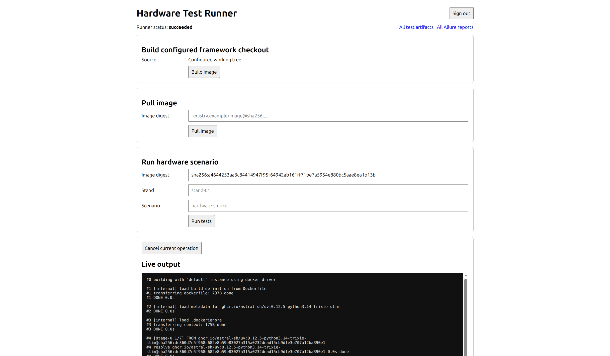
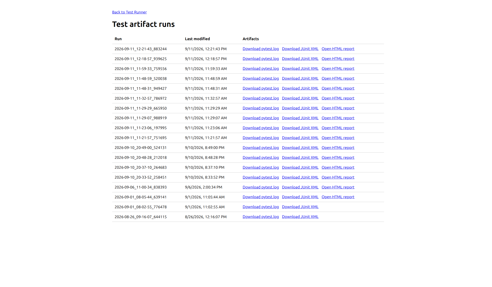
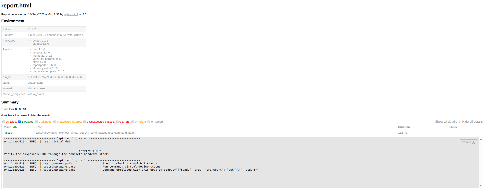
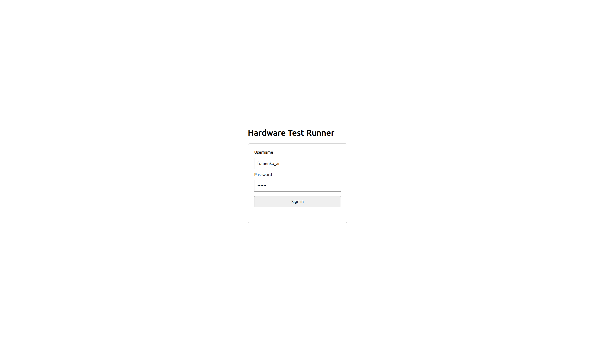

# Hardware test runner service

This optional helper exposes one trusted laboratory server through a small FastAPI application. It
can build the configured framework checkout, pull an allowed image, or run one named hardware
scenario. It intentionally has one global operation slot and no database, persistent queue, or
operation history.

The service is independently packaged from the main `hardware_test` project. It builds Docker CLI
argument arrays directly and does not import the framework package.

## UI preview

The web interface provides controls for building or pulling an image, running a hardware scenario,
following live output, opening the current result, and browsing retained reports. **All test
artifacts** opens the local artifact-run index; **All Allure reports** opens the configured Allure
Storage repository tree; **All ReportPortal launches** opens the configured ReportPortal project's
launch list.



The artifact index remains available after the current status, console, and direct report links
have reset on a page reload:



Completed runs expose a self-contained HTML report with the test result, duration, environment,
and captured logs:



The Allure repository tree groups retained reports by branch and shows their publication date and
time. Select a report identifier under the required branch to open it:


The selected entry opens the complete interactive Allure report with test results, quality gates,
attachments, errors, and navigation through the test hierarchy:


The ReportPortal launch list shows previous runs with test totals, results, and the stand and
scenario attributes. Select a launch to inspect its tests:


The selected launch lists individual tests with their status and duration. **Open ReportPortal
launch** in the runner opens this view for the current result:


Open a test to inspect its logs, including numbered scenario steps, command execution, and results:


Dashboards configured in ReportPortal summarize results across launches. This example shows overall
statistics and the passing rate for the hardware smoke tests:


## Runtime contract

The service stores only the current or most recently completed operation:

```text
/opt/hardware-runner/state/
├── current.json
└── current.log
```

Hardware-test results keep the main project's standard layout:

```text
/opt/hardware-runner/artifacts/
├── latest.log
└── <pytest-run-id>/
    ├── pytest.log
    ├── allure-results/        # only when optional Allure publication is enabled
    └── reports/
        ├── junit.xml
        └── report.html
```

Build, pull, and test execution are separate API operations. While any operation is active, another
request receives HTTP 409 instead of being queued.

Each test operation has an `operation_id` for runner state and a `run_id` for its pytest session.
They currently have the same value, but remain separate fields in `current.json`. Before starting
the container, the runner derives the expected host directory as
`TEST_RUNNER_ARTIFACTS_DIRECTORY/<run_id>` and passes the identity and container artifact root to
pytest explicitly. The runner creates the artifact root; pytest creates the individual session
directory. Existing directories are never reused.

The runner reads results only from that expected directory. It does not scan for a recently
modified directory or require JUnit to identify a session. Therefore a log-only session can still
set `artifact_directory`, while an early process failure that creates no session directory retains
its exit code without attributing unrelated artifacts.

The runner's supported report paths are configured relative to each session directory:

```dotenv
TEST_RUNNER_PYTEST_LOG_PATH=pytest.log
TEST_RUNNER_JUNIT_PATH=reports/junit.xml
TEST_RUNNER_HTML_PATH=reports/report.html
TEST_RUNNER_ALLURE_RESULTS_PATH=allure-results
```

An empty value disables that capability. Paths must remain below the session directory. Public
download names stay `pytest.log`, `junit.xml`, and `report.html`, even when their physical paths
are customized. The settings must match the reporting policy of the selected test image;
historical runs are interpreted with the runner's current path configuration.

A missing or malformed configured JUnit report leaves `summary` unavailable and records a
diagnostic in `junit_message`. It does not replace the pytest `status` or `exit_code`, and it does
not prevent Allure publication or ReportPortal lookup. Disabled JUnit produces no diagnostic.

## Host preparation

Create the runtime directories and place the framework checkout and physical inventory at the
configured locations:

```text
/opt/hardware-runner/
├── framework/
│   └── Dockerfile
├── inventory/
│   └── stands.yaml
├── artifacts/
└── state/
```

Inventory `device_files` remain relative to `stands.yaml`, so mount the complete inventory
directory. Credentials, trusted SSH host keys, networks, and physical devices are optional server
settings and are never accepted from an HTTP request.

Set the allowed registry/repository prefixes before pulling remote images. Comma-separated values
are supported:

```bash
export TEST_RUNNER_ALLOWED_IMAGE_PREFIXES='sha256:,registry.example.com/hardware-tests@sha256:'
```

The default permits only local image IDs returned by a successful build.

### Optional Allure publication

Deploy and prepare `helpers/allure/` first, including its pinned publisher image and an `ars1...`
report-access token. Then add the following to this helper's untracked `.env`:

```dotenv
TEST_RUNNER_ALLURE_ENABLED=true
TEST_RUNNER_ALLURE_PUBLISHER_IMAGE=local/allure-publisher:3.17.0
TEST_RUNNER_ALLURE_ACCESS_TOKEN=ars1.replace-with-report-access-token
TEST_RUNNER_ALLURE_PUBLIC_URL=https://allure.example
TEST_RUNNER_ALLURE_REPOSITORY=pytest-hardware-template
```

When enabled, locally built framework images include the root project's `allure` dependency group.
Remote images must already include that group. The runner collects raw results inside the standard
run directory and invokes the disposable publisher after pytest exits, including after test failures.
The pytest result and Allure publication result are independent: `/v1/current` keeps the original
test `status` and `exit_code` and adds `report_status`, `report_url`, or `report_message`.

The access token is passed through the publisher environment without appearing in Docker command
arguments or operation state. Do not use the broader Storage bootstrap token here.
`TEST_RUNNER_ALLURE_REPOSITORY` is the stable repository name used by Storage; browse its reports
at `/reports/tree?repo=pytest-hardware-template`.
`TEST_RUNNER_ALLURE_PUBLIC_URL` is the browser-reachable Storage origin. When set, the UI exposes
**All Allure reports**; this is separate from **Open Allure report** for the latest publication.

### Optional ReportPortal integration

The runner supports `pytest-reportportal` independently of Allure. Follow the
[ReportPortal helper guide](../reportportal/README.md) to deploy locally or on a server and
configure `TEST_RUNNER_REPORTPORTAL_ENABLED`, `TEST_RUNNER_REPORTPORTAL_ENDPOINT`,
`TEST_RUNNER_REPORTPORTAL_PUBLIC_URL`, `TEST_RUNNER_REPORTPORTAL_PROJECT`, and
`TEST_RUNNER_REPORTPORTAL_API_KEY` in the runner's untracked `.env`.

The endpoint must be reachable from both the runner and test containers. The helper provides
a Compose network overlay for a deployment on the same host. Build a new framework image after
enabling reporting; remote images must contain the `reportportal` group. Results are sent during
pytest execution. Launch names match operation IDs, and the UI links to the project launches
and the latest run. The API exposes independent `reportportal_status`, `reportportal_url`, and
`reportportal_message` fields. Status lookup failures do not change the pytest exit code.

#### Combined reporting verification

To verify Allure and ReportPortal together against the disposable DUT, use the
[combined virtual-stand procedure](../virtual-stand/README.md#verify-allure-and-reportportal-together).
It includes the merged Compose command, rebuilding the framework image with both adapters, and
the expected runner, Allure, ReportPortal, and local-artifact results.

## Start with Docker Compose

### Start the runner

From this directory, create the local configuration from the tracked example:

```bash
cp .env.example .env
```

Edit `.env` when the framework, inventory, artifacts, or state directories use different absolute
host paths. Do not add credentials or secrets to `.env.example`. Create all configured writable
directories before starting the service, then build and start its container:

```bash
docker compose up --build --detach
```

The UI is then available at `http://127.0.0.1:8080/` and OpenAPI documentation at `/docs`.
Set `TEST_RUNNER_PORT` in the helper's local `.env` file when the default host port is occupied;
the container port remains `8080`:

```dotenv
TEST_RUNNER_PORT=8081
```

Set `TEST_RUNNER_DOCKER_NETWORK` when test containers must join a pre-created Docker network. The
Docker virtual stand under `helpers/virtual-stand/` uses this setting for local end-to-end tests.

### Authentication

Authentication is disabled by default. To protect the UI, API, event stream, artifacts, and API
documentation, enable it in the untracked `.env` file. Users are then redirected to the service's
login page:



Set the following values to configure authentication:

```dotenv
TEST_RUNNER_AUTH_ENABLED=true
TEST_RUNNER_AUTH_USERNAME=operator
TEST_RUNNER_AUTH_PASSWORD=replace-with-a-strong-password
TEST_RUNNER_AUTH_SESSION_SECRET=replace-with-a-long-random-value
```

Generate the session secret independently from the password. The service refuses to start when
authentication is enabled without any required value. After a successful login, it stores a
signed `HttpOnly`, `SameSite=Strict` session cookie for seven days by default; neither the username
nor password is stored in the cookie. Configure the lifetime in seconds with
`TEST_RUNNER_AUTH_SESSION_TTL_SECONDS`. Changing the session secret invalidates all existing
sessions.

The default `TEST_RUNNER_AUTH_COOKIE_SECURE=false` supports the documented loopback HTTP setup.
Set it to `true` whenever TLS terminates at the service-facing URL. The `/health`, `/login`, and
login/logout endpoints remain public so health checks and authentication continue to work.

The Compose deployment mounts `/var/run/docker.sock`. Docker daemon access is equivalent to
privileged control of the laboratory host. Deploy only on a dedicated trusted server, bind the HTTP
port to loopback or a protected internal interface, and enable authentication together with TLS
before allowing remote access. The API never accepts arbitrary Docker arguments, build
contexts, host paths, network modes, devices, or credential files.

Docker bind paths are interpreted by the host daemon. Framework, inventory, and artifacts are
therefore mounted into the service at the same absolute paths that the service passes to Docker.

## API

```text
GET    /                         lightweight HTML UI
GET    /artifact-runs            retained local artifact UI
GET    /login                    login page when authentication is enabled
GET    /auth/status              whether authentication is enabled
POST   /auth/login
POST   /auth/logout
GET    /health
GET    /v1/current
GET    /v1/current/events       live Server-Sent Events
POST   /v1/current/cancel
POST   /v1/images/build
POST   /v1/images/pull
POST   /v1/runs
GET    /v1/current/artifacts
GET    /v1/current/artifacts/{pytest.log|junit.xml|report.html}
GET    /v1/artifact-runs
GET    /v1/artifact-runs/{run-id}/{pytest.log|junit.xml|report.html}
GET    /v1/config
```

When Allure is enabled, a completed state may also contain a directly published `report_url`. The
web UI displays it as **Open Allure report** until the page is reloaded.
The UI also provides **All test artifacts**, a retained-run index backed by `/v1/artifact-runs`.
When an Allure public URL is configured, **All Allure reports** opens the Storage tree for the
configured repository. These two history links remain available after reload.

Build the configured checkout:

```bash
curl --request POST http://127.0.0.1:8080/v1/images/build \
  --header 'Content-Type: application/json' \
  --data '{"revision":"working-tree"}'
```

Run a prepared immutable image:

```bash
curl --request POST http://127.0.0.1:8080/v1/runs \
  --header 'Content-Type: application/json' \
  --data '{
    "image":"sha256:0123456789abcdef",
    "stand":"stand-01",
    "scenario":"hardware-smoke"
  }'
```

Follow current output:

```bash
curl --no-buffer http://127.0.0.1:8080/v1/current/events
```

## End-to-end verification

This procedure verifies the runner service, its Docker access, the main framework image, one
prepared hardware scenario, and publication of all test artifacts. Run the test operation only
when the selected physical stand is ready.

### Through the UI

After preparing the host paths, credentials, image access, and physical stand described below:

1. Open `http://127.0.0.1:8080/` and sign in if authentication is enabled.
2. Confirm that the runner status is `idle`, then select **Build image**. Follow **Live output**
   until the build status becomes `succeeded`. The resulting digest is copied automatically into
   **Image digest** in the run form.
3. Enter an approved stand key and scenario name under **Run hardware scenario**, then select
   **Run tests**. Start this step only when that physical stand is ready and reserved.
4. Follow **Live output** until the status becomes `passed` or `failed`, and compare the displayed
   pytest summary with the expected scenario result.
5. Verify that **Download pytest.log**, **Download JUnit XML**, and **Open HTML report** appear.
   Open each artifact and confirm that it belongs to the completed run.
6. Open **All test artifacts** and confirm that the run remains available in the retained index.
   When Allure is enabled, verify both **Open Allure report** for this run and **All Allure
   reports** for the repository history.
7. Optionally start a safe long-running test and select **Cancel current operation** to verify the
   cancellation path. Do not perform this check with a state-changing scenario unless its cleanup
   behavior has already been validated.

The **Pull image** form is an alternative to **Build image** when an immutable image reference is
already published under a prefix allowed by `TEST_RUNNER_ALLOWED_IMAGE_PREFIXES`.

### Through the API

1. Verify the required host paths from `.env`. The framework directory must contain `Dockerfile`,
   and the inventory directory must contain `stands.yaml` plus every relative file listed in its
   `device_files` field. The selected stand must reference device IDs defined by those files.

2. Recreate the service container from the current helper source and check its health:

   ```bash
   docker compose up --build --force-recreate --detach
   docker compose ps
   curl --fail http://127.0.0.1:8080/health
   ```

3. Build a new main framework image. This is separate from building the service image:

   ```bash
   curl --fail --request POST http://127.0.0.1:8080/v1/images/build \
     --header 'Content-Type: application/json' \
     --data '{"revision":"working-tree"}'
   ```

4. Follow the operation until it finishes, or inspect it periodically:

   ```bash
   curl --no-buffer http://127.0.0.1:8080/v1/current/events
   curl --fail http://127.0.0.1:8080/v1/current
   ```

   A successful build has status `succeeded`. Copy its complete `image_digest` value, including
   the `sha256:` prefix.

5. Confirm that the selected image contains a hardware scenario under
   `test-runs/scenarios/<scenario>.yaml` and matching tests under `tests/hardware`. Start the run
   with the new digest, a configured stand, and that scenario:

   ```bash
   curl --fail --request POST http://127.0.0.1:8080/v1/runs \
     --header 'Content-Type: application/json' \
     --data '{
       "image":"sha256:replace-with-the-built-digest",
       "stand":"stand-01",
       "scenario":"hardware-smoke"
     }'
   ```

6. Follow `/v1/current/events` again. After completion, `/v1/current` has status `passed` or
   `failed`, distinct `operation_id` and `run_id` fields, an `artifact_directory` when pytest
   allocated its session, and a JUnit-derived `summary` when pytest produced that report.

7. Verify the published artifact list:

   ```bash
   curl --fail http://127.0.0.1:8080/v1/current/artifacts
   ```

   A completed pytest run normally lists `pytest.log`, `junit.xml`, and `report.html`. Check each
   endpoint directly:

   ```bash
   curl --fail http://127.0.0.1:8080/v1/current/artifacts/pytest.log
   curl --fail http://127.0.0.1:8080/v1/current/artifacts/junit.xml
   curl --fail --output /tmp/hardware-test-report.html \
     http://127.0.0.1:8080/v1/current/artifacts/report.html
   ```

   The HTML report can also be opened from the `Open HTML report` link at
   `http://127.0.0.1:8080/`. Run-specific files remain below the configured artifacts directory.

8. Inspect service diagnostics when an operation fails, then stop the service when finished:

   ```bash
   docker compose logs test-runner
   docker compose down
   ```

## Recovery and retention

If the service restarts while an operation is active, it marks the snapshot `interrupted`; it does
not delete an unknown container automatically. An operator must inspect Docker and the physical
stand before starting another operation.

Starting a new operation replaces `current.json` and `current.log`. Run-specific pytest artifacts
remain under the configured artifacts directory and are cleaned through the main project's normal
artifact retention procedure.

Reloading the UI intentionally presents an old terminal operation as `idle`, clears the live
console, and hides its direct artifact and Allure links. It still restores reusable form values.
Use **All test artifacts** or **All Allure reports** to find completed reports after a reload.

## Development verification

All tests use fake process runners and never access Docker, networks, or physical equipment:

```bash
uv sync --locked
uv run ruff format --check .
uv run ruff check .
uv run ty check
uv run pytest
```
